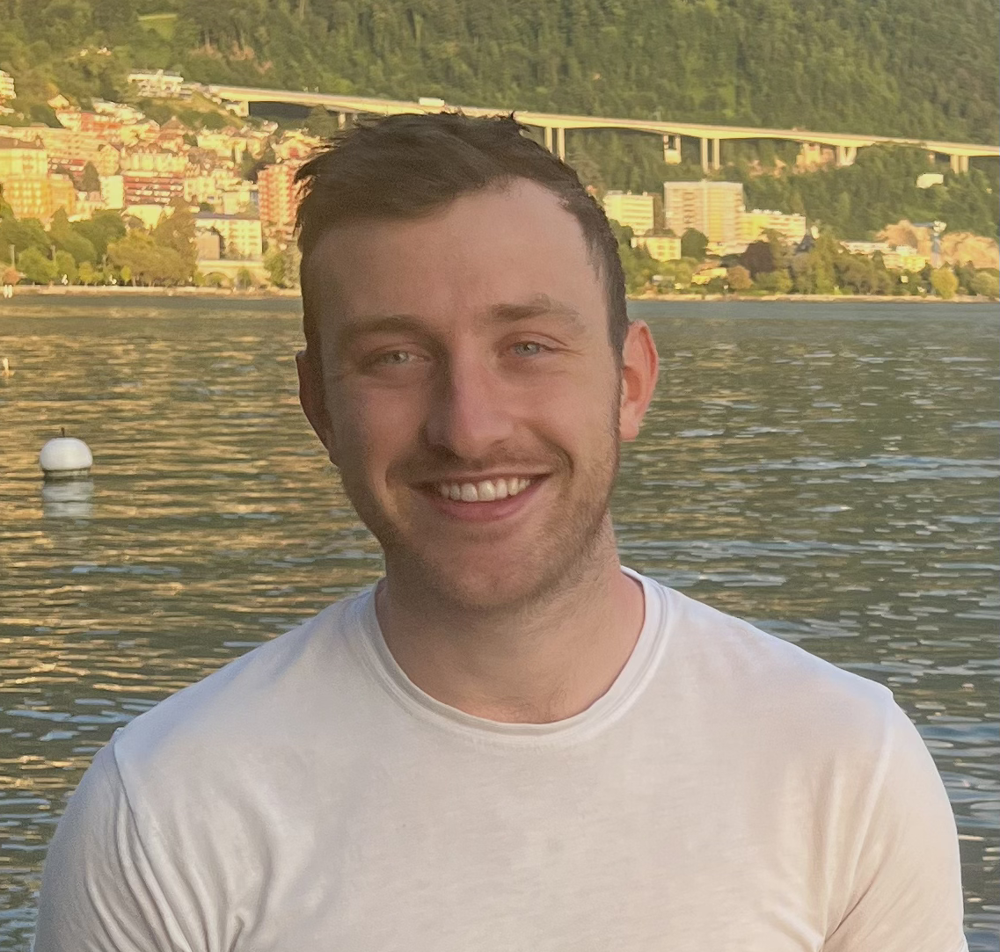

# From Multi-Omics to Gene–Disease Discovery: Knowledge Graphs and LLM-Augmented Analysis

## Welcome Note
Welcome to our tutorial on the use of the use of multi-omics, knowledge graphs, and LLM for gene-disease discovery. We are very much looking forward to welcoming you to ECCB 2026 in Geneva this September.

We've designed our tutorial to show end-to-end working examples using real data from various disease datasets, including from cancer (from The Cancer Genome Atlas) and Autism (from published Gene Expression studies), as well as public health (from the Generation Scotland study). We've worked hard to create a series of detailed Python notebooks and accompanying data that you can take away with you after the tutorial and modify for use in your own study and research.

During the tutorial all you will need is a laptop as we have built a dedicated [JupyterHub](https://biomedicalai.inf.ed.ac.uk/jupyter/hub/login) server where you will be able to code live on a pre-installed environment. We have also made a JupyterBook of the tutorial that will be publicly available via our GitHub. All data and code will also be placed on the University of Edinburgh DataShare resource with a permanent DOI so it is available in perpetuity.

## Schedule of Events
```
Tutorial 8: From Multi-Omics to Gene–Disease Discovery: Knowledge Graphs and LLM-Augmented Analysis
-------------------------------------------------------------------------
09:00 Welcome & Introduction
-------------------------------------------------------------------------
Session 1 –  What is a Network and a Knowledge Graph?

09:05 Part 1 - Gene Expression Networks
09:30 Part 2 - Knowledge Graph Development using NetworkX
10:00 Practical Session 1 - Creating a Phenotype Knowledge Graph from ICD-10 Codes
10:30 Coffee Break
-------------------------------------------------------------------------
Section 2 –  Creating Multi-Omics Profiles

10:45 Part 1 – Linear Methods for Multi-Omic Integration
11:15 Part 2 - Correlation based Methods for Multi-Omic Integration
11:45 Part 3 - Deep Learning Approaches for Multi-Omic Integration
12:15 Practical Session 2 - Multi-Omics Interpretation with Multi-Omic Factor Analysis (MOFA)
12:45 Lunch
-------------------------------------------------------------------------
Section 3 – Building Agentic LLM Workflows for Biomedical Knowledge Graphs 

13:45 Part 1 - What is an LLM agent?
14:15 Part 2 - Tool Use and Model Context Protocol (MCP)
14:45 Practical Session 3 - Querying LLM agents with Molecular Profiles
15:15 Coffee Break
-------------------------------------------------------------------------
Section 4 – Knowledge Graph Query using Multi-Omics and LLMs & Mini-Challenge

15:30 Part 1 - How to Query a Knowledge Graph using Multi-Omic Profiles via LLMs
16:45 Practical Session 4 - Mini-Challenge – Identifying gene disease relationships using
multi-modal modelling
-------------------------------------------------------------------------
17:50 Closing Remarks
```

## Table of Contents
We have developed a Jupyter Book containing all code and some extra materials to be used during the tutorial. 
```{tableofcontents}
```

## Meet the Team

<div style="display: flex; flex-wrap: wrap; gap: 20px;">

  <div style="flex: 1; min-width: 250px; text-align: center;">
    
    <h3>Ian Simpson</h3>
    <p>I am a Professor of Biomedical Informatics and Director of the UKRI AI Centre for Doctoral Training in Biomedical Innovation at the University of Edinburgh. I originally trained in Biochemistry and Genetics before moving into Biomedical Informatics.</p>
    <p>ian.simpson@ed.ac.uk</p>
  </div>

  <div style="flex: 1; min-width: 250px; text-align: center;">
    
    <h3>Barry Ryan</h3>
    <p>I am a postdoctoral researcher at EPFL with Prof. Jacques Fellay. My research interests are multi-omics integration using AI for health. </p>
    <p>barry.ryan@epfl.ch</p>
  </div>

  <div style="flex: 1; min-width: 250px; text-align: center;">
    
    <h3>Chaeeun Lee</h3>
    <p>I am a UKRI CDT student in Biomedical AI in Edinburgh. My research focuses on Natural Language Processing (NLP) within the biomedical domain, addressing challenges such as factual hallucination and domain adaptation. </p>
    <p>chaeeun.lee@ed.ac.uk</p>
  </div>

</div>

<div style="display: flex; flex-wrap: wrap; gap: 20px;">

  <div style="flex: 1; min-width: 250px; text-align: center;">
    
    <h3>Sebestyén Kamp</h3>
    <p>I am a PhD student at the University of Edinburgh specialising in Graph Neural Networks (GNNs) and their applications in complex diseases, with a primary focus on omics data related to cancer and autism spectrum disorder.</p>
    <p>sebestyen.kamp@ed.ac.uk</p>
  </div>

  <div style="flex: 1; min-width: 250px; text-align: center;">
    
    <h3>Hanane Issa</h3>
    <p>I am a student in the HDRUK-Turing Wellcome PhD Programme in Health Data Science, based at the University of Edinburgh. My thesis will focus on patient similarity networks and explainable AI for rare disease diagnosis.</p>
    <p>h.issa@sms.ed.ac.uk</p>
  </div>


</div>
